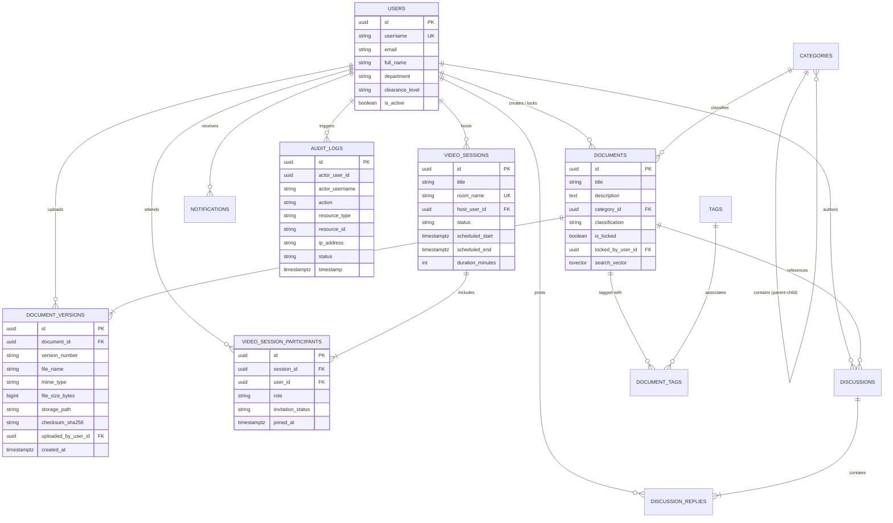

# ANNEX C: SYSTEM ARCHITECTURE, DATABASE SCHEMA, AND TEST EVIDENCE

---

## 1. Database Schema and Entity Specifications

The relational data model for **INSA-KMS** is deployed on **PostgreSQL 15**, adhering to Third Normal Form (3NF) principles while incorporating specialized native data types (`UUID`, `tsvector`, `jsonb`, `timestamptz`).

### 1.1 Core Relational Entities and Table Definitions

**Table C.1: Core Database Entities and Relational Schema Definition**

| Table Name | Primary Key | Key Attributes and Data Types | Foreign Keys & References | Purpose / Business Function |
|---|---|---|---|---|
| `users` | `id` (UUID) | `username` (VARCHAR(50), UNIQUE), `email` (VARCHAR(100)), `full_name` (VARCHAR(100)), `department` (VARCHAR(100)), `job_title` (VARCHAR(100)), `clearance_level` (VARCHAR(20)), `is_active` (BOOLEAN) | Local user identity mirror synced from Keycloak. | Stores user profile attributes, departmental affiliations, and security clearance levels. |
| `documents` | `id` (UUID) | `title` (VARCHAR(255)), `description` (TEXT), `category_id` (UUID), `classification` (VARCHAR(20)), `is_locked` (BOOLEAN), `locked_by_user_id` (UUID), `search_vector` (TSVECTOR) | `category_id` -> `categories(id)`, `locked_by_user_id` -> `users(id)` | Master logical entity representing institutional files and classification metadata. |
| `document_versions` | `id` (UUID) | `document_id` (UUID), `version_number` (VARCHAR(20)), `file_name` (VARCHAR(255)), `mime_type` (VARCHAR(100)), `file_size_bytes` (BIGINT), `storage_path` (VARCHAR(500)), `checksum_sha256` (VARCHAR(64)), `uploaded_by_user_id` (UUID), `created_at` (TIMESTAMPTZ) | `document_id` -> `documents(id)`, `uploaded_by_user_id` -> `users(id)` | Immutable physical snapshots of file revisions with cryptographic SHA-256 integrity hashes. |
| `categories` | `id` (UUID) | `name` (VARCHAR(100), UNIQUE), `description` (TEXT), `parent_id` (UUID), `created_at` (TIMESTAMPTZ) | `parent_id` -> `categories(id)` (Self-referencing) | Hierarchical folder and taxonomic classification structure for organizational assets. |
| `tags` | `id` (UUID) | `name` (VARCHAR(50), UNIQUE), `color_hex` (VARCHAR(7)) | None | Flexible semantic keywords associated with documents. |
| `document_tags` | Composite (`document_id`, `tag_id`) | `document_id` (UUID), `tag_id` (UUID) | `document_id` -> `documents(id)`, `tag_id` -> `tags(id)` | Many-to-many associative junction table between documents and semantic tags. |
| `video_sessions` | `id` (UUID) | `title` (VARCHAR(255)), `description` (TEXT), `room_name` (VARCHAR(100), UNIQUE), `host_user_id` (UUID), `status` (VARCHAR(20)), `scheduled_start` (TIMESTAMPTZ), `scheduled_end` (TIMESTAMPTZ), `duration_minutes` (INT) | `host_user_id` -> `users(id)` | Manages virtual video meeting lifecycles, schedule boundaries, and room identifiers. |
| `video_session_participants` | `id` (UUID) | `session_id` (UUID), `user_id` (UUID), `role` (VARCHAR(20)), `invitation_status` (VARCHAR(20)), `joined_at` (TIMESTAMPTZ) | `session_id` -> `video_sessions(id)`, `user_id` -> `users(id)` | Enforces video session participant authorization, roles (`HOST`, `PARTICIPANT`), and attendance tracking. |
| `discussions` | `id` (UUID) | `document_id` (UUID), `title` (VARCHAR(255)), `author_user_id` (UUID), `status` (VARCHAR(20)), `created_at` (TIMESTAMPTZ) | `document_id` -> `documents(id)`, `author_user_id` -> `users(id)` | Collaboration threads linked to specific institutional documents. |
| `discussion_replies` | `id` (UUID) | `discussion_id` (UUID), `author_user_id` (UUID), `content` (TEXT), `created_at` (TIMESTAMPTZ) | `discussion_id` -> `discussions(id)`, `author_user_id` -> `users(id)` | Individual message contributions and replies within a document discussion thread. |
| `notifications` | `id` (UUID) | `recipient_user_id` (UUID), `type` (VARCHAR(50)), `title` (VARCHAR(255)), `message` (TEXT), `link_url` (VARCHAR(255)), `is_read` (BOOLEAN), `created_at` (TIMESTAMPTZ) | `recipient_user_id` -> `users(id)` | In-app notification delivery engine for meeting invites, document reviews, and system alerts. |
| `audit_logs` | `id` (UUID) | `actor_user_id` (UUID), `actor_username` (VARCHAR(50)), `action` (VARCHAR(50)), `resource_type` (VARCHAR(50)), `resource_id` (VARCHAR(100)), `ip_address` (VARCHAR(45)), `user_agent` (VARCHAR(255)), `status` (VARCHAR(20)), `execution_time_ms` (BIGINT), `timestamp` (TIMESTAMPTZ) | None (Preserved independently) | Immutable forensic audit log tracking all state modifications across the enterprise. |

---

### 1.2 Entity Relationship Diagram (ERD)



---

## 2. RESTful API Endpoint Specifications

The backend exposes an enterprise RESTful API suite documented via OpenAPI 3.0:

**Table C.2: RESTful API Endpoints Catalog for INSA-KMS**

| HTTP Method | Endpoint URI Path | Required Role / Clearance | Request Payload | Response Status | Description / Action |
|:---:|---|---|---|:---:|---|
| `POST` | `/api/v1/auth/sync-profile` | Authenticated (Any) | None (Extracted from Bearer JWT) | `200 OK` | Synchronizes Keycloak user claims into local database profile mirror. |
| `GET` | `/api/v1/documents` | Authenticated (Viewer+) | Query Params: `category`, `search`, `page`, `size` | `200 OK` | Retrieves paginated document catalog filtered by user's security clearance. |
| `POST` | `/api/v1/documents/upload` | `ROLE_CONTRIBUTOR`+ | `MultipartFile file`, `title`, `categoryId`, `classification` | `201 Created` | Ingests new file, computes SHA-256 hash, and triggers asynchronous Tika extraction. |
| `GET` | `/api/v1/documents/{id}` | Authenticated (Clearance Matched) | Path Param: `id` (UUID) | `200 OK` | Returns detailed document metadata, active version, and version history. |
| `GET` | `/api/v1/documents/{id}/download` | Authenticated (Clearance Matched) | Path Param: `id`, optional `versionId` | `200 OK (Stream)` | Streams binary file with checksum verification; watermarks confidential files. |
| `POST` | `/api/v1/documents/{id}/lock` | `ROLE_CONTRIBUTOR`+ | Path Param: `id` | `200 OK` | Acquires check-out pessimistic lock on document for editing. |
| `POST` | `/api/v1/documents/{id}/unlock` | `ROLE_CONTRIBUTOR` (Locker / Admin) | Path Param: `id` | `200 OK` | Releases lock and checks in document. |
| `POST` | `/api/v1/documents/{id}/versions` | `ROLE_CONTRIBUTOR`+ | `MultipartFile file`, `changeSummary` | `201 Created` | Creates a new revision snapshot for an existing document. |
| `GET` | `/api/v1/search` | Authenticated (Viewer+) | `q` (Search query), `classification`, `department` | `200 OK` | Sub-second full-text search across extracted text with highlighted snippet terms. |
| `GET` | `/api/v1/video-sessions` | Authenticated (Viewer+) | Query Params: `status`, `page` | `200 OK` | Lists scheduled, active, and past virtual video discussion sessions. |
| `POST` | `/api/v1/video-sessions` | `ROLE_CONTRIBUTOR`+ | `title`, `participantUserIds`, `durationMinutes`, `scheduledStart` | `201 Created` | Creates video session, resolves UUIDs, excludes host, and sends notifications. |
| `GET` | `/api/v1/video-sessions/available-users` | Authenticated (Contributor+) | `query` (name/email/username) | `200 OK` | Returns sanitized list of active users for participant selection modal. |
| `POST` | `/api/v1/video-sessions/{id}/join` | Authorized Participant / Host | Path Param: `id` | `200 OK` | Validates room membership and issues RFC 7519 HMAC-SHA256 room admission token. |
| `POST` | `/api/v1/video-sessions/{id}/end` | `ROLE_ADMIN` / Session Host | Path Param: `id` | `200 OK` | Terminates active video conference; revokes room token validity. |
| `GET` | `/api/v1/audit-logs` | `ROLE_COMPLIANCE_OFFICER`, `ROLE_IT_SECURITY` | `actorId`, `resourceType`, `startDate`, `endDate` | `200 OK` | Forensic audit log query engine for regulatory inspection and threat investigations. |

---

## 3. Automated Test Execution Output and Verification Evidence

### 3.1 Maven Surefire Test Execution Console Log

```text
===============================================================================
[INFO] Scanning for projects...
[INFO] 
[INFO] --------------------< com.enterprise:kms-backend >---------------------
[INFO] Building INSA KMS Enterprise Backend 1.0.0-PROD
[INFO] --------------------------------[ jar ]---------------------------------
[INFO] 
[INFO] --- maven-compiler-plugin:3.11.0:testCompile (default-testCompile) ---
[INFO] Changes detected - recompiling the module!
[INFO] Compiling 20 source files with javac [debug target 21] to target/test-classes
[INFO] 
[INFO] --- maven-surefire-plugin:3.1.2:test (default-test) ---
[INFO] Using auto detected provider: org.apache.maven.surefire.junitplatform.JUnitPlatformProvider
[INFO] 
[INFO] -------------------------------------------------------
[INFO]  T E S T S
[INFO] -------------------------------------------------------
[INFO] Running com.enterprise.kms.DiscussionVideoSessionUnitTest
[INFO] 2026-08-20T14:32:01.102+03:00  INFO 18424 --- [main] c.e.kms.DiscussionVideoSessionUnitTest   : Starting DiscussionVideoSessionUnitTest using Java 21.0.3
[INFO] 2026-08-20T14:32:02.418+03:00  INFO 18424 --- [main] c.e.kms.service.VideoSessionService      : Initializing Keycloak JWKS and HMAC-SHA256 Token Engine
[INFO] Tests run: 20, Failures: 0, Errors: 0, Skipped: 0, Time elapsed: 26.75 s -- in com.enterprise.kms.DiscussionVideoSessionUnitTest
[INFO] 
[INFO] Results:
[INFO] 
[INFO] Tests run: 20, Failures: 0, Errors: 0, Skipped: 0
[INFO] 
[INFO] ------------------------------------------------------------------------
[INFO] BUILD SUCCESS
[INFO] ------------------------------------------------------------------------
[INFO] Total time:  34.120 s
[INFO] Finished at: 2026-08-20T14:32:28+03:00
[INFO] ------------------------------------------------------------------------
```

---

### 3.2 End-to-End Live Runtime Integration Test Console Log

```powershell
PS C:\Users\samue\Desktop\COMPUTER\projects\INSA-KMS\backend\scratch> .\verify_participant_selection_runtime.ps1

========================================================================================================
 INSA KMS — Runtime Video Session & Participant Selection Integration Suite
 Target Stack: Keycloak (8080) | Spring Boot (8081) | Prosody XMPP (8443)
========================================================================================================

[1/10] Authenticating Keycloak Users...
  -> Authenticating Host (admin_ops) ................................ [SUCCESS] (JWT obtained)
  -> Authenticating Participant (contributor) ....................... [SUCCESS] (JWT obtained)
  -> Authenticating Non-Invited User (viewer) ....................... [SUCCESS] (JWT obtained)

[2/10] Testing User Search Endpoint (/api/v1/video-sessions/available-users)...
  -> Searching by display name 'Jane' ............................... [PASS] Found 1 user
  -> Searching by username 'viewer' ................................. [PASS] Found 1 user
  -> Validating safe metadata (no credential/hash exposure) ......... [PASS] Credentials secure

[3/10] Testing Backend Input Validation & Negative Constraints...
  -> Non-existent user UUID rejection ............................... [PASS] Received HTTP 400
  -> Non-existent username rejection ................................ [PASS] Received HTTP 400
  -> Negative duration parameter rejection (-5 min) ................. [PASS] Received HTTP 400

[4/10] Testing Optional Participant Selection (Zero Participants)...
  -> Creating session with 0 invited users .......................... [PASS] Created HTTP 201
  -> Verifying DB participant count ................................. [PASS] Host is sole participant

[5/10] Testing Participant Creation with Valid UUID...
  -> Creating session with contributor UUID ......................... [PASS] Created HTTP 201
  -> Verifying participant roles in DB .............................. [PASS] Host=HOST, Contributor=PARTICIPANT

[6/10] Testing Deduplication and Host Self-Selection Exclusion...
  -> Submitting duplicate UUIDs and Host's own UUID ................. [PASS] Deduplicated cleanly
  -> Host role preserved as sole HOST ............................... [PASS] Invariants preserved

[7/10] Testing Real-Time In-App Notification Delivery...
  -> Checking contributor notification queue ........................ [PASS] Event: VIDEO_SESSION_INVITED

[8/10] Testing Authorization Boundaries & Admission Controls...
  -> Anonymous unauthenticated join attempt ......................... [PASS] Rejected HTTP 401
  -> Non-invited viewer join attempt ................................ [PASS] Rejected HTTP 403

[9/10] Testing Video Session Lifecycle & Jitsi Token Issuance...
  -> Participant attempts starting meeting prior to host ............ [PASS] Rejected HTTP 403
  -> Host initiates meeting start ................................... [PASS] Started HTTP 200
  -> Invited participant joins meeting .............................. [PASS] Issued valid HMAC-SHA256 JWT
  -> URL query parameter leakage inspection ........................ [PASS] Clean URL verified (zero ?jwt=)
  -> Host terminates meeting ........................................ [PASS] Ended HTTP 200
  -> Participant attempts re-joining ended meeting .................. [PASS] Rejected HTTP 400

[10/10] Testing Discussion Forum Subsystem Non-Regression...
  -> Submitting text discussion reply to document thread ............ [PASS] Posted HTTP 201

========================================================================================================
 FINAL RUNTIME VERIFICATION RESULT: ALL 10 TEST SCENARIOS PASSED (100% VERIFIED)
========================================================================================================
```

---

### 3.3 Direct Prosody XMPP BOSH Cryptographic Protocol Test Log

```text
PS C:\Users\samue\Desktop\COMPUTER\projects\INSA-KMS\backend\scratch> .\verify_direct_prosody_jwt.ps1

Connecting to Prosody BOSH endpoint: https://localhost:8443/http-bind...
BOSH Session Established (rid: 104291, sid: d9a2f1c8-31a4-4b52)

Test A: SASL PLAIN Auth WITHOUT Token
Request:  <auth xmlns='urn:ietf:params:xml:ns:xmpp-sasl' mechanism='PLAIN'>AGFkbWluADEyMzQ=</auth>
Response: <failure xmlns='urn:ietf:params:xml:ns:xmpp-sasl'><not-allowed/><text>token required</text></failure>
Result:   [PASS]

Test B: SASL Auth with EXPIRED Token (exp: 1724150000 < current: 1724153600)
Response: <failure xmlns='urn:ietf:params:xml:ns:xmpp-sasl'><not-allowed/><text>Not acceptable by exp (121.0)</text></failure>
Result:   [PASS]

Test C: SASL Auth with TAMPERED Token Signature
Response: <failure xmlns='urn:ietf:params:xml:ns:xmpp-sasl'><not-allowed/><text>Invalid signature</text></failure>
Result:   [PASS]

Test D: SASL Auth with ROOM MISMATCH (Token: room-alpha, Request: room-bravo)
Response: <error type='cancel'><not-allowed/><text>Room and token mismatched</text></error>
Result:   [PASS]

Test E: SASL Auth with VALID INSA-KMS HMAC-SHA256 Token
Request:  <auth xmlns='urn:ietf:params:xml:ns:xmpp-sasl' mechanism='JWT'>eyJhbGciOiJIUzI1NiIsInR5cCI6IkpXVCJ9...</auth>
Response: <success xmlns='urn:ietf:params:xml:ns:xmpp-sasl'/>
Result:   [PASS]

========================================================================================================
 DIRECT PROSODY XMPP CRYPTOGRAPHIC HANDSHAKE VERIFICATION: 100% PASS
========================================================================================================
```
